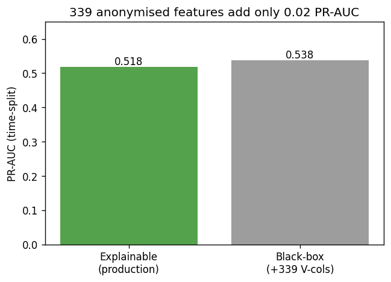
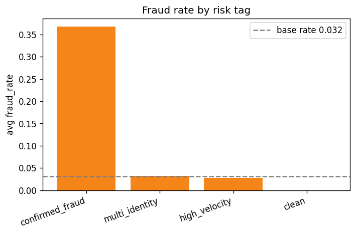
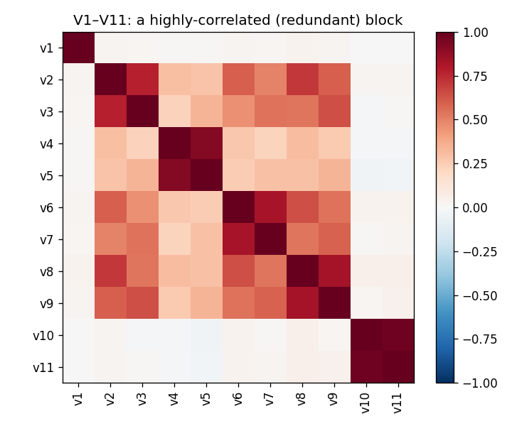
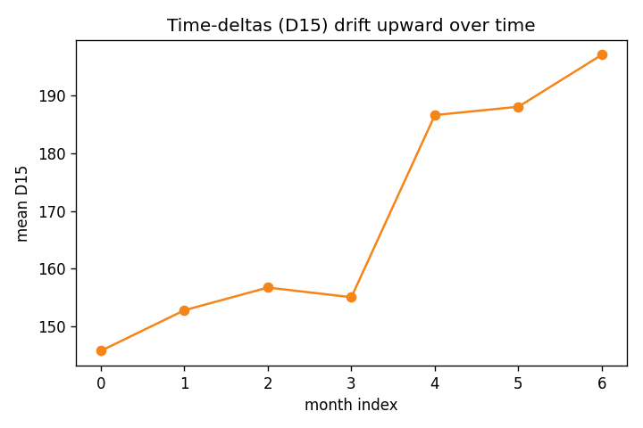

# User Analytics & Risk Platform

End-to-end analytics project on a real payments/e-commerce transaction base (**IEEE-CIS Fraud**): **profile users, segment them, tag them, and detect fraud/abuse.** Built to mirror a Data-Analyst (Risk) brief and to demonstrate the modern analyst stack (SQL + **dbt** + Python + **BigQuery** + **Looker Studio**).

Stack: **dbt** (layered, tested, documented transformations) · **DuckDB** (local warehouse) and **BigQuery** (free cloud sandbox) — the same dbt project runs on both · **Python** (pandas, scikit-learn) for the ML · **Looker Studio** on BigQuery (free, permanent BI dashboard).

**Result: an explainable, time-validated fraud model — ROC-AUC 0.913 / PR-AUC 0.540 — matching a 339-feature black box, using only features I can explain.**

## At a glance
<table>
<tr>
<td width="50%"><br><sub><b>Explainable model matches the 339-column black box</b> (PR-AUC, time-split).</sub></td>
<td width="50%"><br><sub><b>Tag effectiveness:</b> fraud concentrates in label-derived tags, not naive heuristics.</sub></td>
</tr>
<tr>
<td width="50%"><br><sub><b>EDA:</b> the 339 anonymised V-columns are highly redundant (why the black box adds nothing).</sub></td>
<td width="50%"><br><sub><b>Drift:</b> time-deltas grow over time, so they are normalised per period.</sub></td>
</tr>
</table>

**[Live dashboard (Looker Studio on BigQuery)](https://lookerstudio.google.com/reporting/d0032be5-ae94-487d-8046-d5649f64453c)** · Write-ups: **[results](docs/results.md)** · **[approach & decisions](docs/approach_and_decisions.md)** (the interview script) · **[EDA](docs/eda.md)**.

## Why this project
Maps almost line-by-line to the kind of work it showcases — user tagging systems, user profiling, customer segmentation, anomaly/fraud detection, behavioural analysis on large-scale data, in a fintech/internet-platform domain. See [`docs/jd_mapping.md`](docs/jd_mapping.md).

> Honesty: this is a **capability demonstration** (a built artifact), not claimed work experience. The dbt project is built and run on **both DuckDB and BigQuery** (free sandbox), and the **Looker Studio dashboard is live** on the BigQuery marts — all three are genuinely run here, so all three are claimed. Metabase was dropped (never built; kept only as an optional appendix in `dashboards/metabase_setup.md`).

## dbt project (the analytics layer)
A layered, adapter-portable dbt project that runs on **both** DuckDB and BigQuery:
```
sources (raw.transactions, raw.identity)
  -> staging      stg_transactions, stg_identity
  -> intermediate int_transactions_enriched
  -> marts        user_features, user_segments (RFM), user_tags, user_risk_profile
```
Tested (not_null / unique on keys, relationships across layers, accepted_values on tags and
segments, 2 singular tests), documented (model + column descriptions), with an **exposure**
pointing at the dashboard. `DBT_PROFILES_DIR=. dbt build` passes clean (PASS=55) and
`dbt docs generate` works on **both** DuckDB and the **BigQuery free sandbox** from the same
codebase (see [`dbt/BIGQUERY.md`](dbt/BIGQUERY.md)).

## Phases
- **Phase 1 — core (closes the dbt + cloud-BI skill gap):**
  transactions → **dbt** marts (`staging` → `intermediate` → user-level `marts`) → **RFM segmentation** (dbt) with a KMeans alternative (Python) → **user-tagging system** (value / lifecycle / risk, in dbt) → **explainable fraud model** (time-validated, Python) + a **black-box comparison** → a **Looker Studio** dashboard on BigQuery. Design rationale: **[`docs/approach_and_decisions.md`](docs/approach_and_decisions.md)**.
- **Phase 2 — differentiators:**
  **bonus/promo-abuse ring detection** (multi-account / graph community detection) + **cohort, retention & a mock A/B test**.

## Quickstart
```bash
# 1. Python env
python -m venv .venv && source .venv/bin/activate
pip install -r requirements.txt

# 2. No server needed — DuckDB is a local file (platform.duckdb).

# 3. Get the data: accept IEEE-CIS rules on Kaggle first, then download + load
export KAGGLE_API_TOKEN=$(cat ~/.kaggle/access_token)
python -c "import kagglehub,glob,shutil; p=kagglehub.competition_download('ieee-fraud-detection'); [shutil.copy(f,'data/raw/') for f in glob.glob(p+'/train_*.csv')]"
python src/load_ieee.py                    # -> raw.transactions, raw.identity (+ joined view)

# 4. Transform with dbt (staging -> intermediate -> marts, runs all tests)
cd dbt && DBT_PROFILES_DIR=. dbt build && DBT_PROFILES_DIR=. dbt docs generate && cd ..

# 5. ML + charts (Python)
python src/model_explainable.py     # explainable model (time-split) -> txn_risk + user_risk
python src/model_blackbox.py        # black-box comparison (quantifies the trade-off)
python src/segmentation.py          # KMeans alternative -> user_segments_kmeans
python src/make_charts.py           # PNG dashboard tiles -> docs/charts/

# 6. Cloud warehouse (free BigQuery sandbox) — see dbt/BIGQUERY.md for the one-time auth, then:
#   python src/load_bigquery.py && cd dbt && BQ_PROJECT=<id> DBT_PROFILES_DIR=. dbt build --target bigquery

# 7. BI dashboard — Looker Studio on BigQuery (free, permanent): dashboards/looker_studio_setup.md
#    (Metabase is an optional alternative, not part of the claimed stack: dashboards/metabase_setup.md)
```

## Structure
```
src/         load_ieee.py, load_bigquery.py, export_marts.py, segmentation.py(KMeans alt),
             tagging.py(reference impl), model_explainable.py, model_blackbox.py,
             explore_features.py, eda_columns.py, abuse_rings.py(P2), make_charts.py, db.py
dbt/         dbt_project.yml, profiles.yml (duckdb + bigquery), BIGQUERY.md,
             models/{sources.yml, staging/, intermediate/, marts/, exposures.yml}, tests/
data/        raw/ (gitignored — IEEE-CIS CSVs) + README (dataset + download)
dashboards/  metabase_setup.md, looker_studio_setup.md, exports/ (gitignored CSVs)
docs/        eda.md, approach_and_decisions.md, results.md, jd_mapping.md, learning_path.md, charts/
```

## Data
**IEEE-CIS Fraud Detection** (Kaggle competition) — real `isFraud` labels + card/device/email identity features. Two source tables (`raw.transactions`, `raw.identity`) loaded by `src/load_ieee.py`; dbt joins and aggregates to a `client_id` (card1 + addr1 proxy — IEEE-CIS has no explicit user id). See `data/README.md`.

## Results
**Run on real IEEE-CIS data** (2026-06-26): 590,540 txns → layered, tested dbt marts → RFM segmentation + a user-tagging system + an **explainable, time-validated fraud model**. Headline: the explainable model (only *documented* features + engineered customer-id/baseline) scores **PR-AUC 0.54 / ROC-AUC 0.913**; adding all 339 anonymised columns adds **nothing** (black-box ROC-AUC 0.913 — essentially identical, explainable marginally ahead) — so explainability is not a compromise here, it is the better model. Within ~0.01 ROC-AUC of the domain expert's published 0.9245, using only documented features. Full reasoning in **[`docs/approach_and_decisions.md`](docs/approach_and_decisions.md)**; numbers + charts in **[`docs/results.md`](docs/results.md)**. The **durable** dashboard artifacts are this repo + the PNG charts in `docs/charts/`; the live dashboard (Looker Studio on BigQuery) builds from the dbt marts.

## Status
- **dbt**: layered project (staging → intermediate → marts), tested + documented, with an exposure. `dbt build` (PASS=55) + `dbt docs generate` pass clean on **both DuckDB and the BigQuery free sandbox** from one codebase.
- **BigQuery**: done — ran against the free sandbox (no billing); the marts are populated (39,974 clients). Reproduce via `dbt/BIGQUERY.md`.
- **Dashboard**: **[live on Looker Studio](https://lookerstudio.google.com/reporting/d0032be5-ae94-487d-8046-d5649f64453c)** (free, permanent), built on the BigQuery `user_risk_profile` mart — total clients, segment overview, and fraud rate by segment; durable PNG tiles also in `docs/charts/`. (Metabase was dropped: only a billable plan was available, and BigQuery + Looker Studio cover the cloud-BI claim for free.)
- Next: Phase 2 ring detection, a productionised alert threshold, cohort/A-B analysis.

> **Cost guardrail.** BigQuery free sandbox only (never enable billing); Looker Studio is
> free; no cards anywhere. With Metabase dropped there is no trial to tear down.
