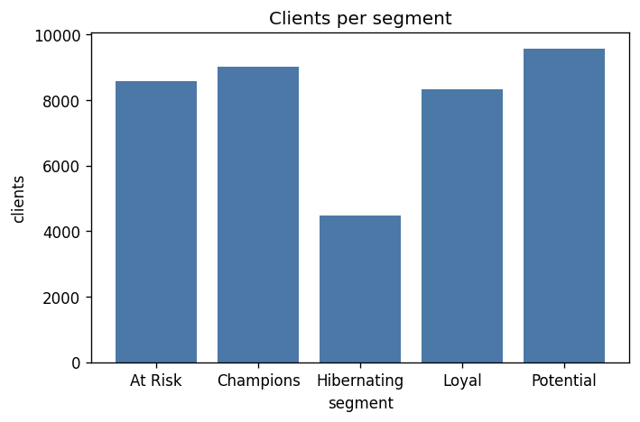
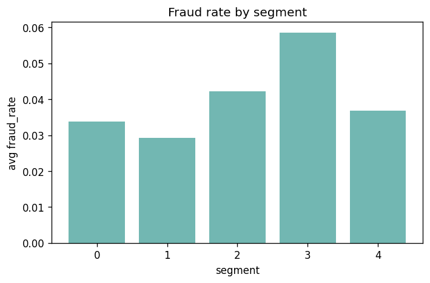

# Results — User Analytics & Risk

Real run on **IEEE-CIS Fraud Detection** (Kaggle). Warehouse: DuckDB · transforms: dbt (tested) · analytics: Python · BI: Metabase. All numbers below are from the live pipeline.

## Data
- 590,540 transactions, **3.5% fraud** (20,663). Aggregated to **39,974 clients** (`card1 + addr1` proxy — IEEE-CIS has no explicit user id; documented approximation).

## Segmentation (RFM + KMeans, 5 segments)
A small **whale** cohort stands out: segment 3 = 17 clients, **~$338k avg spend, 3,755 avg txns, 5.9% fraud rate** (the highest) — exactly the high-value/high-risk group a risk team prioritises.

 

## User-tagging system
Three families — **value** (vip/high/mid/low), **lifecycle** (active/dormant/new/one_off), **risk** (confirmed_fraud/multi_identity/high_velocity/clean).

## Tag effectiveness — the honest finding

- `confirmed_fraud` clients: **36.7%** fraud rate — but this tag is **derived from the label**, so it's partly circular; not a discovery.
- `multi_identity` (**3.2%**) and `high_velocity` (**2.8%**) sit **at or below** the 3.5% base rate. So naive identity/velocity heuristics **do not** concentrate fraud here. That's the point: simple rules look plausible but don't earn trust — the supervised model has to.

## Fraud model — explainable vs black-box (see `docs/approach_and_decisions.md`)
Both on the **same time-based split** (train earlier 70%, test later 30% — no peeking at the future):

| Model | Features | PR-AUC | ROC-AUC |
|---|---|---|---|
| **Explainable (production)** | every **documented** feature — amount, all association counts (C1–14), all time-deltas (D1–15), match flags, distances, card/email/device/identity, hour — + engineered sharper customer id, cross-account sharing & a leak-free per-customer baseline | **0.525** | **0.901** |
| Black-box (comparison) | the same **+ all 339 anonymised V-columns** | 0.538 | 0.901 |

**The headline:** the 339 opaque features add only **+0.013 PR-AUC and 0.000 ROC-AUC** on top of the explainable model. Explainability is effectively *free* — so the model I can defend ships. 

- **Strategy that got here:** the V-columns are mostly entity aggregations, so I rebuilt that signal *explainably* — a sharper customer id (`card1+card2+card3+card5 + addr1 + account-birthday`) and behavioural features on top — rather than use the black box.
- **Honest finding on per-customer baselines:** with ~222k customers over 590k transactions (~2.6 each), most appear once or twice, so a personal baseline has little history to learn from and barely moved the score here. It's the *right* approach for a **repeat-user platform** (e.g. an exchange); on one-shot card data the signal lives in the association counts.
- **Time-based honesty:** a random split flatters fraud models by letting them see the future; all numbers above are forward-in-time.
- **Operating points** (set the alarm on cost): flag riskiest 1% → precision 0.87 / recall 0.25; 2% → 0.69 / 0.40; 5% → 0.40 / 0.58.
- **Top drivers** (all explainable): association counts (C1/C14/C13/C9), email domains, distances, time-deltas, billing region.

## Limitations (interview-ready)
Client id is an approximation; baseline feature set by design; `confirmed_fraud` tag is label-derived. The value here is a **trustworthy, reproducible pipeline** (dbt-tested) with an evaluation that interrogates its own signals — not a leaderboard score.
